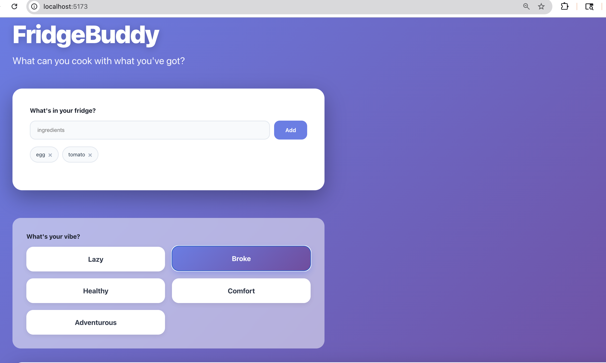
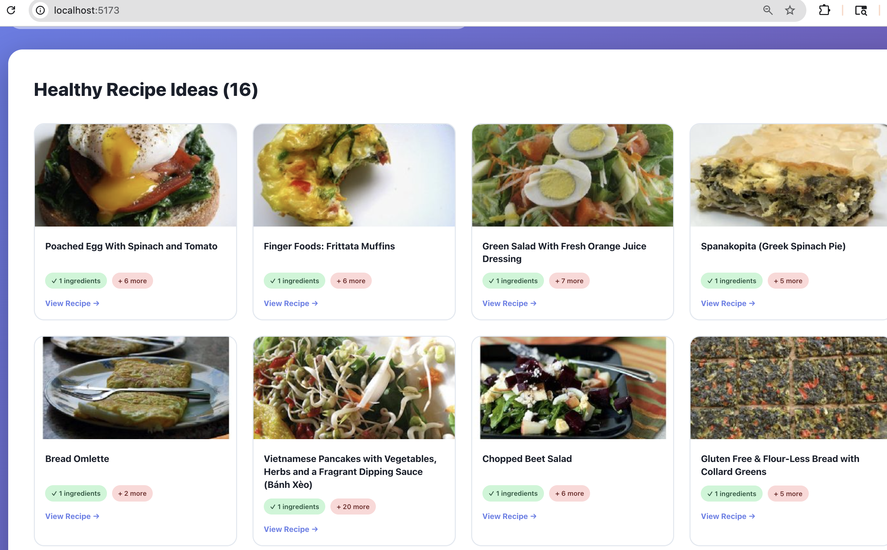
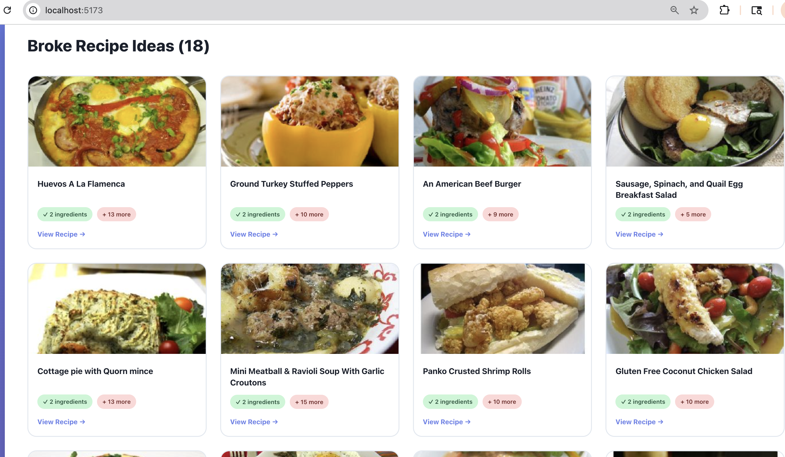
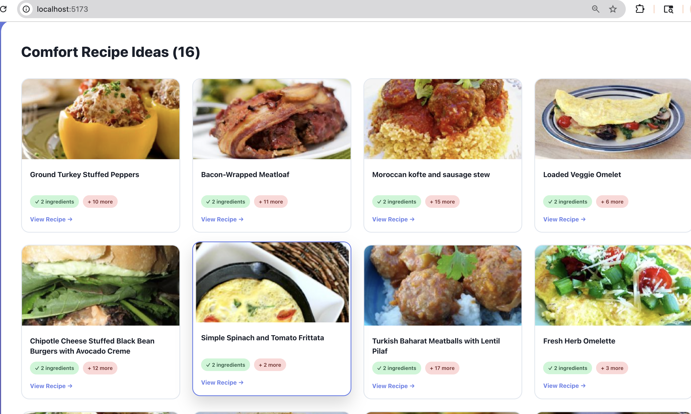

# [FridgeBuddy]
## Problem Statement
I often find myself staring at my fridge wondering what I can cook with random ingredients I have on hand. Instead of letting food go to waste or ordering takeout unnecessarily, I wanted a quick way to discover recipes based on what's already in my kitchen and my current mood. This saves money, reduces food waste, and makes meal planning effortless.

## Solution
FridgeBuddy is a React web application that takes your available ingredients and instantly suggests recipes you can make. It also includes "mood filters" to match recipes to how you're feeling. Whether you want something quick (Lazy mode), budget-friendly (Broke mode), healthy (Healthy mode), popular courses(Comfort mode), or trying something new (Adventurous mode).

## API Used
- **API Name**: Spoonacular Food API
- **API Documentation**: https://spoonacular.com/food-api/docs
- **How it's used**: The app uses the "Find by Ingredients" endpoint to search for recipes that match the user's available ingredients. It returns recipe suggestions with information about how many ingredients the user already has and how many they'd need to buy.The "complexSearch" endpoint refines the search based on the user's mood applying filters such as diet type, cooking time, or price.

## Features
- Ingredient Input: Enter multiple ingredients separated by commas to generate recipe ideas using what you already have
- Mood-Based Filtering: Choose a mood — Lazy, Broke, Healthy, Comfort, or Adventurous to tailor recipes by cooking time, price, diet, or popularity.
- Recipe Results: Displays  how many ingredients you already have versus how many are missing. Each recipe includes a link to the full instructions on Spoonacular.
## Setup Instructions
1. git clone https://github.com/Clairezhao1112/FridgeBuddy.git
    cd FridgeBuddy
2. npm install
3. VITE_SPOONACULAR_KEY=api_key_here
4. npm run dev
5. Open browser at [http://localhost:5173]
## AI Assistance
- Breaking the project into components:
I learned the importance of organizing code into smaller, reusable parts such as a Header, IngredientInput, MoodPicker, and RecipeResults component. This structure made it easier to manage individual sections of the app. Specifically, I in the ingredient input, I added simple logic to handle both uppercase and lowercase input, trimming extra spaces, and styling each ingredient as its own tag for future adjustments. This was helpful because it kept the app well-organized and made the overall interface cleaner and more user-friendly.
- Building the mood filter system:
I learned how to filter and sort recipes using specific parameters like cooking time, diet type, meal category, and cost to match the user’s selected mood.I modified AI’s version by making mood selection optional ensuring that the app could still fetch recipes using only ingredients when no mood was chosen.
- Displaying data:
I realized that AI is really good at normalizing, designing and structuring data, something I found difficult to understand on my own. I prompted AI to make minor tweaks to the data mapping logic so that it would only display meaningful information. Claude suggested adding a large text box showing detailed recipe descriptions from each link but it was alot of words on a page, really complex of code so I removed it to improved the app flow. 
## Screenshots

  
  

  
  

## Future Improvements
I think the current design of the app is quite simple and focused mainly on functionality. Since most of my time was spent on building and refining the backend logic, I’d like to invest more effort in creating a more engaging and visually appealing UI. In the future, I think it would be helpful to add dietary preference filters (e.g., vegan, gluten-free, keto) or cuisines(e.g.,Chinese, Japanese, American) to give users more personalized recipe results. Adding small feature such as "favorite" or "save recipe for future" options. 